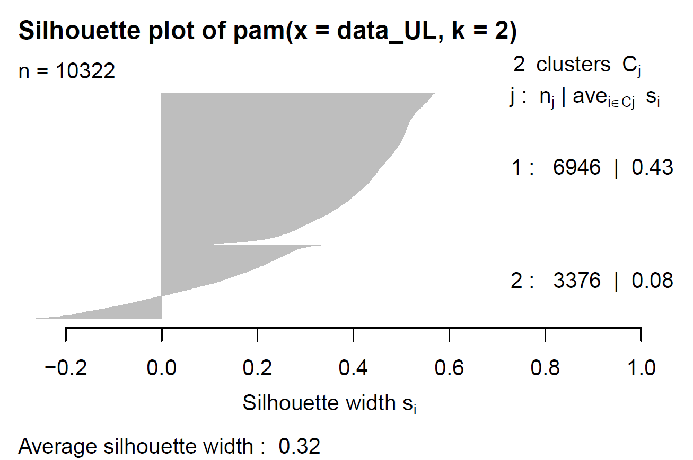

<style>
div.footnotes {
  position: absolute;
  left: 160px;
  margin-bottom: 5px;
  width: 80%;
  font-size: 0.6em;
}
</style>

<script src="https://ajax.googleapis.com/ajax/libs/jquery/3.1.1/jquery.min.js"></script>
<script>
$(document).ready(function() {
  $('slide:not(.backdrop):not(.title-slide)').append('<div class=\"footnotes\">');

  $('footnote').each(function(index) {
    var text  = $(this).html();
    var fnNum = (index+1).toString();
    $(this).html(fnNum.sup());

    var footnote   = fnNum + '. ' + text + '<br/>';
    var oldContent = $(this).parents('slide').children('div.footnotes').html();
    var newContent = oldContent + footnote;
    $(this).parents('slide').children('div.footnotes').html(newContent);
  });
});
</script>

```{r setup, include=FALSE}
source(here::here("scripts/setup.R"))
data <- read.csv(file = here::here("Data/data.csv")) #load previously cleand file from data part
```


## Agenda {data-background=Agenda.jpg data-background-size=cover}


- **Introduction** 
- **Exploratory Data Analysis**
- **Modelling**
    * **Supervised Learning**
        - Linear Regression
        - Regression Tree
        - K-NN
    * **Unsupervised Learning**
        - PAM
        - PCA
- **Conclusion**

# Introduction {data-background=RIO_VIEW.jpg data-background-size=cover}


# {data-background=data_presentation.PNG data-background-size=cover}

# Exploratory Data Analysis {data-background=RIO_VIEW.jpg data-background-size=cover}

## **Data Distribution and Outliers** {.flexbox .vcenter}

```{r echo=FALSE,  warning = F}
data3 <- read.csv(file = here::here("presentation/data3.csv")) 

# NO TRANSFORMATION
## area - !!OUTLIERS !!
a1 <- data3 %>% 
  ggplot(aes(x= city, y=area))+
  geom_boxplot(fill = "cornflowerblue") +
  coord_flip()+
  xlab("") +
  ylab(expression(paste("Area [", m^2,"]", sep = "")))
## rooms 
a2 <- data3 %>% 
  ggplot(aes(x= city, y=rooms))+
  geom_boxplot(fill = "cornflowerblue")+
  scale_y_continuous(breaks=seq(0,14,2)) + 
  coord_flip()+
  xlab("") +
  ylab("Rooms")
## bathrooms
a3 <- data3 %>% 
  ggplot(aes(x= city, y=bathroom))+
  geom_boxplot(fill = "cornflowerblue")+
  scale_y_continuous(breaks=seq(0,10,2)) +  # to show integer numbers in x axis
  coord_flip()+
  xlab("") +
  ylab("Bathroom")
## parking space
a4 <- data3 %>% 
  ggplot(aes(x= city, y=parking))+
  geom_boxplot(fill = "cornflowerblue")+
  scale_y_continuous(breaks=seq(0,12,2)) +  # to show integer numbers in x axis
  coord_flip()+
  xlab("") +
  ylab("Parking")
## floor - !!OUTLIERS!!
data$floor <- as.integer(data$floor) 
a5 <- data3 %>% 
  #filter (floor<=81) %>% #don't look at outliers (>81)
  ggplot(aes(city, y = floor))+
  geom_boxplot(fill = "cornflowerblue")+
  coord_flip()+
  xlab("") +
  ylab("Floors")
# hoa - !!OUTLIERS!!
a6 <- data3 %>% 
  # mutate(across(hoa, ~replace(., . == 0 , 1))) %>% # so that when we log value = 1 -> we get 0
  ggplot(aes(x= city, y=hoa))+
  geom_boxplot(fill = "cornflowerblue") +
  coord_flip()+
  xlab("") +
  ylab("HOA (R$)")

# rent 
a7 <- data3 %>% 
  ggplot(aes(x= city, y=rent))+
  geom_boxplot(fill = "cornflowerblue") +
  coord_flip()+
  xlab("") +
  ylab("Rent (R$)")
# property tax  !!OUTLIERS!!
a8 <- data3 %>%  
  # mutate(across(property_tax, ~replace(., . == 0 , 1))) %>% #transform 0 values into 1 
  ggplot(aes(x= city, y= property_tax))+
  geom_boxplot(fill = "cornflowerblue")+
  coord_flip()+
  xlab("") +
  ylab("Property Tax (R$)")

grid.arrange(a1,a2,a3,a4,a5,a6,a7,a8,
             widths = c(1, 1),
             #top = textGrob("Data distribution", gp=gpar(fontsize=16)),
             left = textGrob("City", rot = 90, gp = gpar(fontsize = 12)) )

```


## **Financial Features** {.flexbox .vcenter}

```{r echo=FALSE,  out.height="100%", out.width= "100%", warning = FALSE}
data2 <- read.csv(file = here::here("presentation/data2.csv")) #load previously cleand file from data part

data2 <- data2 %>% pivot_longer(c(hoa,rent,property_tax,fire_insurance), 
                      names_to = "fees", 
                      values_to = "fees_amount") 
data2$fees <- as.factor(data2$fees) # transform into factor to be able to reorder them


p9 <- data2 %>% group_by(city, fees) %>% # we want to plot the average fees by city
  summarize(amount = round(mean(fees_amount)), 1)  %>% # average taxes, rent,.. amount for each city
  mutate(fees = fct_relevel(fees, "rent", "hoa", "property_tax", "fire_insurance")) %>% # to reorder column fees when displaying plot
  group_by(city) %>% mutate(total = round(sum(amount)),1) %>%  #to have the total fees by city
  mutate("%fees" = round((amount/total * 100), 2)) %>% #digits = 2
  ggplot(aes(x = reorder(city,-amount), #reorder from high to low fees city
             y = amount, 
             fill = fees,
             text = paste('amount: ', amount,
                          '</br>total fees: ', total  #to add label
                           )
             )) + 
  geom_bar(stat="identity", position ="dodge") +
  scale_fill_brewer(palette = "PuBu", direction = -1 ) + 
  labs(x = "Cities", y ="Average Fees Amount (R$)", title = "Higher rent is in Sao Paulo") +
  geom_text(aes(label = paste0(round(`%fees`, 1), "%")), #to put text above bars
            position = position_dodge(0.9),
            #color = "grey",
            size = 2.5, #size of text
            vjust = -0.5, 
           )

p9 %>% ggplotly(tooltip = c("fees", "text")) %>%
  style(textposition = "top")
```

# Supervised Learning {data-background=RIO_VIEW.jpg data-background-size=cover}

```{r include=FALSE}
# Data splitting
set.seed(2)
index.tr <- createDataPartition(y = data$rent, p = 0.8, list = FALSE)
df.tr <- data[index.tr,]
df.te <- data[-index.tr,]

# CV with  k-fold = 10
trctrl <- trainControl(method = "cv", number = 10)
```


# {data-background=LR.PNG data-background-size=cover}


# {data-background=RT.PNG data-background-size=cover}


# {data-background=knn.PNG data-background-size=cover}


# {data-background=model_comparaison.PNG data-background-size=cover}


# Unsupervised Learning {data-background=RIO_VIEW.jpg data-background-size=cover}

## **Partition Around the Medoid Method** {.flexbox .vcenter}

<center>
{width=60%}
</center>

## **Principal Components Analysis Method** {.flexbox .vcenter}

```{r echo=FALSE , warning = FALSE}
#load the data
data_UL <- read.csv(file = here::here("Data/data_UL.csv")) %>% mutate_if(is.character, as.factor)
#Scale the numerical variables
data_UL[,-c(1,7,8)] <- scale(data_UL[,-c(1,7,8)]) 

#PAM
pam <- pam(data_UL, k=2)

#Uses same data set data_UL but delete all the categorical 
data_PCA <- data_UL %>% select(-c(1,7,8))
library(FactoMineR)
library(factoextra)
#compute the pca 
pca <- PCA(data_PCA, ncp = 8, graph = FALSE)


#To combine the clustering method and the PCA
pca7 <- fviz_pca_biplot(pca,
             col.ind = factor(pam$cluster),
             alpha.ind = 0.5, 
             palette = "Set2", 
             geom.ind = "point",
             repel = TRUE, 
             title = "PCA Biplot") + #, subtitle = " Dimension 1 and 2"
  theme(legend.position = "none")#, legend.title = "Cluster")
pca8 <- fviz_pca_biplot(pca,
             col.ind = factor(pam$cluster), 
             alpha.ind = 0.5, 
             palette = "Set2", 
             geom.ind = "point",
             repel = TRUE, 
             axes = 2:3, 
             title = "") +
  labs(col = "Cluster", shape = "Cluster")

grid.arrange(pca7, pca8, nrow = 1, ncol = 2)
```


# Conclusion {data-background=RIO_VIEW.jpg data-background-size=cover}

## Project Takeways {data-background=Agenda.jpg data-background-size=cover}

- **Linear regression** widely used in <br> real estate estimation 
- **Limitations**
    * **Features** 
        - High correlations 
        - Remaining variation in the errors
 
