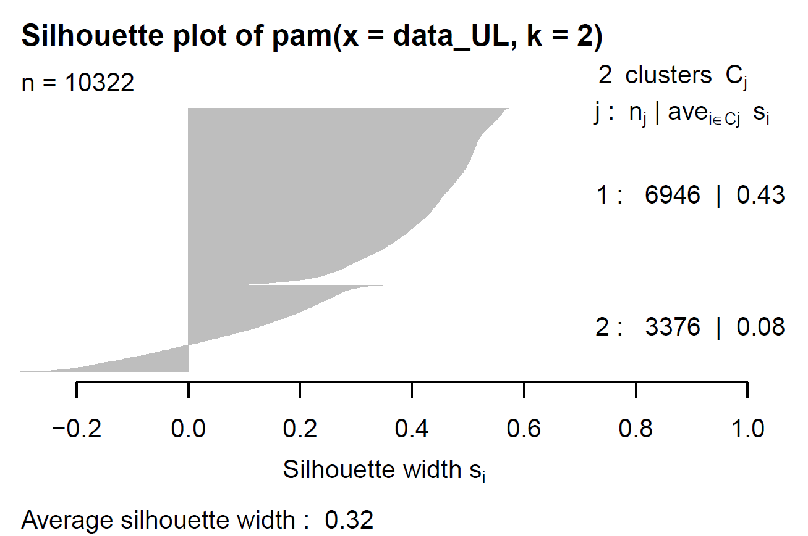

# 4. Modelling

```{r, echo = FALSE, message = FALSE}
source(here::here("scripts/setup.R"))

data<-read.csv(file = here::here("Data/data.csv"))
```

In the modelling part of our project, we will start by applying supervised learning methods and compare them. Lastly, two method of unsupervised learning will be implemented and discussed. 

## 4.1 Supervised learning

The supervised learning methods chosen are the following : 
<br> - The **Linear regression**
<br> - The **Regression tree**
<br> - The **KNN**

We first proceeded to split at random our data into a training set (80%) and a test set (20%) to be able to assess the performance of our models. In addition, we also created a set with the cross validation method (k-fold = 10) that will be used to train the different models.


```{r include=FALSE}
# Data splitting
set.seed(2)
index.tr <- createDataPartition(y = data$rent, p = 0.8, list = FALSE)
df.tr <- data[index.tr,]
df.te <- data[-index.tr,]

# CV with  k-fold = 10
trctrl <- trainControl(method = "cv", number = 10)
```

### 4.1.1 Linear regression

We will start by creating a full linear model regression with all our variables, except `fire_insurance` and `total`. After that, we will proceed to a forward variables selection from the null linear model, based on AIC criteria.

**Full model**
<br>
$lm(formula = rent ~ city + area + rooms + bathroom + parking + floor + animal + furniture + hoa + propertytax, data = df.tr)$
<br>

```{r warning=FALSE, include=FALSE, out.height="70%", out.width="70%"}

set.seed(2)

myfull <- lm(rent ~ city+
               area+
               rooms+
               bathroom+
               parking+
               floor+
               animal+
               furniture+
               hoa+
               property_tax,
               data=df.tr)

summary(myfull)

```

Adjusted R-squared is quite low with a value of 0.585.
<br>

```{r include=FALSE}
#Variable selection and interpretation
#Compare with the null model
set.seed(2)
mynull <- lm(rent~1,data=df.tr) 

#Stepwise regression
#Forward selection from my null linear model
#Forward selection based on AIC criteria
 
mod.lm.sel <- step(mynull,scope = list(lower=mynull,upper=myfull),direction = "forward",trace = 0)
summary(mod.lm.sel)

##We end up with a model without the variable animal, adjusted R-squared is still low and remains at 58.5 %.
##It means that all variables, except "animal", are significant based on the AIC.
```
**Selected model**
<br>
$lm(formula = rent ~ bathroom + area + hoa + furniture + city +  propertytax + floor + parking + rooms, data = df.tr)$
<br>
Here is the results of the full and the selected model :
<br>
<div align="center">
```{r}
# library(sjPlot)
# library(sjmisc)
# library(sjlabelled)

set.seed(2)
tab_model(myfull, mod.lm.sel,
          show.ci = FALSE,
          show.se = TRUE,
          show.stat = TRUE,
          #show.aic = TRUE,
          string.se = "SE",
          string.stat = "t-value",
          string.pred = "Coefficients",
          dv.labels = c("Full model", "Model Selection")
        #  CSS = list(
        #    css.centeralign = 'text-align: center;' 
        #  )
          
        )
```
 </div>
<br>
We end up with a model without `animal`. The adjusted R-squared is still low and remains at 58.5 %. It means that all variables, except `animal`, are significant based on the AIC.
<br>
We can see first of all that `rent` decreases significantly with the cities of Campinas and Porto Alegre. The rents will be cheaper on average and especially in Campinas -525.20 BRL (with Belo Horizonte as reference point) everything else being equal. Rents in Rio de Janeiro and São Paulo will be on average significantly higher and São Paulo will have on average the highest rents +574.43 BRL, again, everything else being equal.
<br>
We can see that, logically, `area`, `rooms`, `parking` and especially `bathrooms` are positively associated to an increase in rent, everything else being equal. This is not something we can tell from the linear regression but we have been able to see in our EDA that all these variables, the explanatory ones, are positively correlated. 
<br>
On average, there is a decrease in `rent` depending on the `floor`. From the first floor to the twelfth, basement being the reference point, the `rent` is associated with a a lower value. Nevertheless, from floor thirteenth to eighteenth, `rent` starts to be positively impacted, the impact is stronger from the nineteenth floor and more (basement still being the reference level). It is surprising to see that floor zero is on average much more expensive than the first twelfth floors, everything else being equal. Indeed, properties rent, tend to be higher as the floors increase. As mentioned earlier floor zero can be houses, that have higher rents than most flats.
A furnished residence will have a considerably higher rent +1120.39 BRL than an unfurnished residence. 
<br>
<br>
We decided to train our model with cross-validation in order to prevent overfitting.
We can see, in the following table, that the R-squared oscillates between 48.3% and 64.2% with 10 folds. 
<br>
```{r message=FALSE, warning=FALSE}
#train the model with cross-validation
set.seed(2)

lm.cv <- train(rent ~ bathroom + area + hoa + furniture + city + 
    property_tax + floor + parking + rooms, 
    data = df.tr, 
    method = "lm", 
    trControl = trctrl, 
    trace = 0)

#We have protected our model from overfitting and we can see that the Rsquared oscillates between 48% and 64% with 10 fold.
lm.cv[["resample"]]
```

<br>
Now, we decided to fit our predicted values against the observations. 
```{r}
##Observations vs Predictions
set.seed(2)

mod.lm.pred <- predict(lm.cv, newdata=df.te)
#summary(mod.lm.pred)

##Visualization

LR <- df.te %>% 
  ggplot(aes(x = rent, 
             y = mod.lm.pred, 
             colour = rent,
             text = paste('pred: ', round(mod.lm.pred,1)
                           )
             )) +
  geom_point(size = 1, show.legend = FALSE) +
  geom_abline(colour = "darkred", alpha = 0.5) +
  xlab("Rent") +
  ylab("Prediction") +
  ggtitle("Linear Regression")

g2 <-  LR %>% ggplotly(tooltip = c("x", "text"),
                        width = 600, height = 400) 

htmltools::div(g2, align = "center") #to align ggplotly

```

We can observe that our linear model makes less error in predicting rents up to more or less 5'000 BRL than in predicting rents above this limit. The graph above shows us that after 5'000 BRL the observations become even more spread out and difficult to predict.

### 4.1.2 Regression tree

We start by plotting an unpruned regression tree.
```{r}
set.seed(2)
# regression without pruning
tree.reg<-rpart(rent~.,data=df.tr)
rpart.plot(tree.reg,main="Unpruned Regression tree")
```
We can observe that the variables used to predict `rent` are `area`, `bathroom`, `property_tax` and `hoa`.

```{r,  out.height="70%", out.width="70%"}
set.seed(2)

tree.reg.pred <- predict(tree.reg, newdata.reg=df.te)
##Visualization

reg_tree <- df.tr %>% 
  ggplot(aes(x = rent, 
             y = tree.reg.pred,
             colour = rent,
             text = paste('pred: ', round(tree.reg.pred,1)
                           )
             )) +
  geom_point(size = 1, show.legend = FALSE) +
  geom_abline(colour = "darkred", alpha = 0.5) +
  xlab("Rent") +
  ylab("Prediction") +
  ggtitle("Unpruned Regression tree")

g3 <-  reg_tree %>% ggplotly(tooltip = c("x", "text"),
                        width = 600, height = 400) 

htmltools::div(g3, align = "center") #to align ggplotly


# plot(tree.reg.pred ~ df.tr$rent,xlab="Observed rents", 
#     ylab="Predictions",
#     main="Unpruned Regression tree")
# abline(0,1, col="red")
```
We can see the the model does not have a great accuracy especially, when the observed rents are higher.

```{r, warning = FALSE}
set.seed(2)
# k fold cross validation and cp tuning for pruning the tree
tree.fold<-train(rent~.,data=df.tr,method = 'rpart',trControl=trctrl)
tree.fold

```

The train caret function used with the cross validation has chosen a model pruned with a best tuned cp of `r tree.fold$bestTune$cp`.
<br>
Therefore here we plot the pruned tree based on the optimal cp. 
```{r}
# ploting the tree after pruning
tree.prune <- prune(tree.fold$finalModel, cp=tree.fold$bestTune$cp)
rpart.plot(tree.prune,main="Pruned Regression Tree with cp = 0.0494")
```
We can see that the tree chosen has now only 3 branches.
```{r}
#summary with surrogate splits
summary(prune(tree.reg, cp=tree.fold$bestTune$cp))
```
On this summary we see that for node 1, if `area` is not available the model will use `bathroom` to predict the rent. For node 3 if `property_tax` is not available the model will use `hoa`.

```{r}
# variable importance

varImp(tree.prune)%>%
  arrange(desc(Overall)) %>%
  kable() %>%
  kable_styling() %>%
  add_header_above(c("Variable importance" = 2)) %>%
  scroll_box(height = "200px")

```
<br>
`property_tax` and `area` are the two most important variables, this is why with a tree of length three, the model uses these features. `bathroom` is the third most important, but it is rather used as surrogate split probably due to the fact that it highly correlated with `area` (0.75).
<br>
<br>
When we look at the predictions versus observed values, it looks almost like the unpruned graph, meaning pruning the tree simplifies the model but did not affect too much the errors.
```{r,  out.height="70%", out.width="70%"}
# plotting prediction versus real data
tree.prune.pred <- predict(tree.prune, newdata.reg=df.te)

## visualisation
reg_tree_pruned <- df.tr %>% 
  ggplot(aes(x = rent, 
             y = tree.prune.pred,
             colour = rent,
             text = paste('pred: ', round(tree.prune.pred,1)
                           )
             )) +
  geom_point(size = 1, show.legend = FALSE) +
  geom_abline(colour = "darkred", alpha = 0.5) +
  xlab("Rent") +
  ylab("Prediction") +
  ggtitle("Pruned Regression Tree")

g3 <-  reg_tree_pruned %>% ggplotly(tooltip = c("x", "text"),
                        width = 600, height = 400) 

htmltools::div(g3, align = "center") #to align ggplotly


#plot(tree.prune.pred ~ df.tr$rent, 
#     xlab="Observed Rent", 
#     ylab="Predictions",
#     main="Pruned Regression tree")
# abline(0,1, col="red")
```


### 4.1.3 KNN  

The third, and last supervised learning model we performed is the K-Nearest Neighbors (KNN).
We decided to let the model set the optimal k parameter (the optimal number of neighbors taken into account to allocate an observation to a class).

```{r}
set.seed(2)
#model with kfol 10 and tuning parameter of k
knn.reg<-train(rent~.,data=df.tr,method = 'knn',trControl=trctrl,preProcess = c("center","scale"),tuneLength = 10)

knn.reg

```
The model selected k with a value of `r knn.reg$bestTune$k`, based on the RMSE. A high value for k provides a robust model, however the goodness-of-fit is not excellent: the R squared is lower than 0.6. 

Finally, we plot the predictions of this model:

```{r,  out.height="70%", out.width="70%"}
# optimal k is equal to 21
set.seed(2)

knn.reg.pred <- predict(knn.reg, newdata=df.te)

knn <- df.te %>% mutate(pred= knn.reg.pred) %>%
  ggplot(aes(x= rent, y= pred, colour = rent)) + 
  geom_point(size = 1, show.legend = FALSE) + 
  geom_abline(colour = "darkred", alpha = 0.5) +
  ggtitle(paste0("KNN Regression with K =",knn.reg$bestTune$k,sep="")) +
  xlab("Rent") +
  ylab("Prediction")

g5 <-  knn %>% ggplotly(tooltip = c("x", "pred"),
                        width = 600, height = 400) 

htmltools::div(g5, align = "center") #to align ggplotly


	
# df.te %>% mutate(pred=knn.reg.pred) %>%
#  ggplot(aes(x=rent, y=pred)) + 
#  geom_point() + geom_abline(slope=1, intercept = 0)+ggtitle("KNN Regression with k=11")

```

We can observe that the prediction is better for smaller rent values.


### 4.1.4 Scoring and model selection

```{r}
#R2 for each model

lm.r2<-R2(predict(lm.cv, newdata = df.te), df.te$rent)
CART.r2<-R2(predict(prune(tree.reg, cp=tree.fold$bestTune$cp),
                    newdata = df.te), df.te$rent)
KNN.r2<-R2(predict(knn.reg, newdata = df.te), df.te$rent)

#RMSE for each model

lm.RMSE<-RMSE(predict(lm.cv, newdata = df.te), df.te$rent)
CART.RMSE<-RMSE(predict(prune(tree.reg, cp=tree.fold$bestTune$cp), 
                        newdata = df.te), df.te$rent)
KNN.RMSE<-RMSE(predict(knn.reg, newdata = df.te), df.te$rent)

#MAE for each model

lm.MAE<-MAE(predict(lm.cv, newdata = df.te), df.te$rent)
CART.MAE<-MAE(predict(prune(tree.reg, cp=tree.fold$bestTune$cp),
                      newdata = df.te), df.te$rent)
KNN.MAE<-MAE(predict(knn.reg, newdata = df.te), df.te$rent)

#tibble with all the scores

Models<-c("Linear Regression","Regression Tree","KNN")
R2<-c(lm.r2,CART.r2,KNN.r2)
RMSE<-c(lm.RMSE,CART.RMSE,KNN.RMSE)
MAE<-c(lm.MAE,CART.MAE,KNN.MAE)

scores<-tibble(Models,R2,RMSE,MAE) %>% arrange(desc(R2))

kable(scores)

```
Comparing the scores of our three models we can see that the *Linear Regression* and *KNN* are equivalent regarding their R2 but the *Linear Regression* has a  lower RMSE than the two other models. By default, *Regression Tree* is the worst. However even the best model does not perform very well on our data set. As we have seen previously his adjusted R2 is 58.5% which is not so good. It is important to highlight the fact that this last R2 is different from the one used in the model comparison.

### 4.1.5 Applying our models on observations
To illustrate our three models, we decided to apply them on two observations: the highest rent value and one value close to the median.


```{r}
data[2156,] %>% 
   kable(align = "llccccccccc") %>%
   kable_styling() %>%
  add_header_above(c("Highest Rent" = 12))

data[5170,] %>% 
   kable(align = "llccccccccc") %>%
   kable_styling() %>%
  add_header_above(c("Median Rent" = 12))

```


#### **Linear Model**
Unfortunately, as we saw previously on the linear regression graph, our model makes considerable error in predicting rents above ~5000 BRL. The model predicts a rent of ~15'577 BRL instead of 45'000 BRL, which is three times lower than it should.
<br>
For the median one, the linear regression is closer to the observed value 1’390 BRL but still makes large errors and predicts a rent of ~2'159 BRL which is an overestimate of 770 BRL.

```{r include=FALSE}
# LM.comp.max
predict(lm.cv, newdata = data[2156,])
```

```{r include=FALSE}
# LM.comp.med 
predict(lm.cv, newdata = data[5170,])
```

|    | Predicted | Observed | 
|:---|:---       |:---      |
|**Highest Rent**| 15'577| 45'000|
|**Median Rent**|2'159|1'390|

#### **Pruned Regression Tree** 
```{r}
rpart.plot(tree.prune)
```

For the first instance, as the `area` of the property is 700 m^2^ and the `property_tax` is 8'750 BRL, the regression tree model indicates to go on the right two times.  The predicted rent is 8'771 BRL, while the true rent is 45'000 BRL. 
<br>
For the second instance, it would predict 2'501 BRL because we would go left at the first node. Indeed, the area of this property is lower than 153m^2^. The prediction error is quite large as the observed rent is 1'390 BRL, almost twice smaller.  
<br>
We can see that this model makes already large errors with a typical value of the data set. It does an even far worst job with the greatest observation. This explains why regression tree was the worst model among the others in the previous comparison. 

#### **KNN**

With KNN, the prediction of the maximum observation is far from reality. We predict 13'690 BRL instead of 45'000 BRL, around three times under the real value. 
<br>
KNN is more accurate with the median observation; it predicts 1'945 BRL while the actual value is 1'390 BRL.
```{r include=FALSE}
#knn.comp.max
predict(knn.reg, newdata = data[2156,])
```


```{r include=FALSE}
#knn.comp.med
predict(knn.reg, newdata = data[5170,])
```


|  *KNN*  | Predicted | Observed | 
|:---|:---       |:---      |
|Highest Rent| 13'690| 45'000|
|Median Rent|1'945|1'390|


## 4.2 Unsupervised learning

In this part, we will be applying two unsupervised learning methods : 
<br> - The **PAM method** for *Clustering*
<br> - The **PCA method** for *Dimension reduction*

### 4.2.1 Clustering

As our data contains both categorical and numerical variables, all other clustering methods seen in class were not adapted to our needs. The hierarchical clustering methods can be importantly affected by extreme observations which is called *hiding effect*. As we have seen, although we have deleted meaningless outliers, we still have many extreme observations. In our case, the PAM method, thanks to the fact that it uses the medoids, is more robust and can be used for numerical and categorical features unlike K-Means method. 
<br>
<br>
To start we scaled our data to make sure that the clustering does not get influenced by the differences in variables scales. Indeed, we have `area`, `hoa`, `rent` and `proprety tax` that can take very high values while variables like the number of `rooms` or `bathroom`have maximums of 13 and 10. 
```{r data_UL, echo=FALSE, message=FALSE, warning=FALSE}
#load the data
data_UL <- read.csv(file = here::here("Data/data_UL.csv")) %>% mutate_if(is.character, as.factor)
#Scale the numerical variables
data_UL[,-c(1,7,8)] <- scale(data_UL[,-c(1,7,8)]) 

#Display the table
head(data_UL, n=3L) %>% kable(caption = "Table 4.2.1.1 : Scaled dataset used for unsupervised learning methods")
```

To determine the number of clusters to be set, we used the `fviz_nbclust` function. As the function only takes a numeric matrix or a data frame as input, we turned the categorical variables into dummies. Since we had three categorical columns; one with five levels and the last two with two each, we passed from eleven variables to fourteen (deleting the original columns).

```{r data_UL_D, echo=FALSE, message=FALSE, warning=FALSE}
#transform categorical into dummies
data_UL_D <- data_UL %>% 
  dummy_cols(remove_first_dummy = TRUE, ignore_na = FALSE) %>% 
  select(!(c(city, animal, furniture)))

#Display the table
head(data_UL_D, n=3L) %>% kable(caption = "Table 4.2.1.2 : Dataset with dummies used for fviz_nbclust()")

#Subsetting the data because the fviz_nbclust run for a too long time when knitting
set.seed(234)
index.tr <- caret::createDataPartition(y = data_UL_D$rent, p= 0.1, list = FALSE)
data_UL_D <- data_UL_D[index.tr,]
```

Then, we have chosen the *silhouette statistic* in order to maximize the goodness of fit of the clustering. As displayed on the graph below, we found out that **k=2** would be the number of clusters maximizing the average silhouette of the clusters. We will not be displaying the results here but we also checked the within-cluster sum of square method [WSS] and the elbow minimizing it was also k=2. 

```{r PAM_nb_clust1, echo=FALSE, message=FALSE, warning=FALSE}
##Number of cluster based on statistics
fviz_nbclust(data_UL_D,    # recommend 2 clusters 
             pam, 
             method = "silhouette", 
             k.max = 14, verbose = FALSE) +
  labs(title = "Optimal number of clusters = 2")
```
```{r PAM_nb_clust2, eval=FALSE, message=FALSE, warning=FALSE, include=FALSE, out.height="60%", out.width="80%"}
fviz_nbclust(data_UL_D,       # recommend 2 clusters -elbow
             pam,
             method = "wss", 
             k.max = 14, verbose = FALSE) 
             Available dist method : "euclidean", "maximum", "manhattan", "canberra", "binary" or "minkowski"
```
So, we used the `pam` function specifying k=2, following our previous results. Here are the two medoids: 

```{r PAM, echo=FALSE, message=FALSE, warning=FALSE}
#Compute the PAM clustering method with k=2 following the silhouette stat
pam <- pam(data_UL, k=2)

Medoids <- as_tibble(pam$medoids) %>% 
  mutate(cluster = c(1,2), id = pam$id.med) %>%
  relocate(c("cluster", "id"), .before = city)

Medoids$city <- c("Rio de Janeiro", "Sao Paulo")
Medoids$animal <- c("yes", "yes")
Medoids$furniture <- c("no", "no")

Medoids %>% kable(align = c("cclcccccllccc"), caption = "Table 4.2.1.3 : PAM medoids with k=2")
```
We can see that the medoid of cluster one seems to be a smaller property than the medoid of cluster two. With the following plots we can see that this is, indeed, confirmed. Cluster one is characterized by houses that could be called standard whereas cluster two includes houses that are bigger and exceptional. As a matter of fact we can see more outbound values in cluster two; equally in terms of houses characteristics than in financial charges.
```{r PAM Graphical Rep.numeric, echo=FALSE, message=FALSE, warning=FALSE, fig.dim=c(8,6)}
#out.height= "60%", out.width= "100%"
data <- read.csv(file = here::here("Data/data_UL.csv")) 
#Graphical representation of the cluster 
data.comp <- data %>% data.frame(Cluster=factor(pam$clustering), Id=row.names(data))
data.df <- melt(data.comp, id=c("Id", "Cluster")) 

x1 <- data.df %>% filter(variable %in% c("area", "rooms", "bathroom", "parking","floor")) %>% 
  mutate(value = as.numeric(value)) %>% 
  mutate(value = round(value, digits = 2)) %>% 
  ggplot(aes(x = Cluster, y=value, fill=Cluster)) +
  geom_boxplot() +
  facet_wrap(~variable, ncol=3, nrow=10, scales = "free_y") +
  theme_minimal()+
  scale_fill_brewer(palette = "Pastel2")+
  theme(legend.position = "none")+
  labs(subtitle = "Second cluster characterised \n by bigger proprieties")

x2 <- data.df %>% filter(variable %in% c("hoa", "rent","property_tax")) %>% 
  mutate(value = as.numeric(value)) %>% 
  mutate(value = round(value, digits = 2)) %>% 
  ggplot(aes(x = Cluster, y=value, fill=Cluster)) +
  geom_boxplot() +
  facet_wrap(~variable, ncol=3, nrow=10, scales = "free_y") +
  theme_minimal()+
  scale_fill_brewer(palette = "Pastel2") +
  theme(legend.position = "none")+
  labs(subtitle = "Second cluster characterised \n by higher financial charges")

#grid.arrange(x1, x2, ncol=2, nrow = 1)
(x1 | x2)
```
The graphical representation of the categorical variables by clusters does not give us much more information but our hypothesis of "exceptional real estate" in cluster two is once again confirmed as there are a fewer of it. We can highlight the fact that São Paulo is the only city in which the difference, between the number of houses of each cluster, is the smaller. This can be explained by the fact that São Paulo is a dynamic financial center in Brazil since many years. 

```{r PAM Graphical Rep.categorical, echo=FALSE, message=FALSE, warning=FALSE, out.height= "60%", out.width= "100%"}
x3 <- data.df %>% filter(variable %in% c("city")) %>% 
  ggplot(aes(as.factor(value), group=Cluster, fill=Cluster)) +
  geom_bar(stat = "count", position = "dodge", alpha = 0.5, width = 0.7) +
  theme_minimal()+
  scale_fill_brewer(palette = "Set2") +
  theme(legend.position = "none") +
  labs(title = "Fewer houses in cluster two ",
       x = "Cities", y = "Number of Houses") 

x3 <- x3 %>% ggplotly(tooltip = c("count", "Clust"))

x4 <- data.df %>% filter(variable %in% c("animal", "furniture")) %>% 
  ggplot(aes(as.factor(value), group=Cluster, fill=Cluster)) +
  geom_bar(stat = "count", position = "dodge", alpha = 0.5, width = 0.7) +
  facet_wrap(~variable, ncol=10, nrow=5) +    #, scales = "free_y"
  theme_minimal()+
  scale_fill_brewer(palette = "Set2") +
  theme(legend.position = "none") +
  labs(title = "Fewer houses in cluster two ",
       x = "Accepted -- Furnished", y = "Number of Houses") 

x4 <- x4 %>% ggplotly(tooltip = c("count", "Clust"))
#x3 <- x3 %>% ggplotly(tooltip = c("count", "Clust"), outheight = 280, width = 500)
#x4 <- x4 %>% ggplotly(tooltip = c("count", "Clust"), height = 280, width = 500)

subplot(x3, x4, shareY = TRUE)


```
Finally, we can have a look to the silhouette plot. We have 6'946 observations in the cluster one and the 3'376 remaining in cluster two. The first silhouette statistic is well above the one of cluster two with respectively 0.43 and 0.08. We can see that all the observations of cluster one are correctly clustered, while cluster two have a bit less than half of its observations misclustered. The average silhouette is of 0.32 which is not really impressive. Nevertheless, we should not over interpret it as we do not have a point of comparison. 
<center>
{width=60%}
</center>

```{r Plot Silhette, eval=FALSE, message=FALSE, warning=FALSE, include=FALSE, out.height="60%", out.width="100%"}
#Silhouette plot
plot(silhouette(pam)) # !!! CA MARCHE PAS CHEZ MOI LE PLOT EST BLANC 0.32 avant
#0.63 sans scale 
#save_plot("plot.pdf", p, ncol = 2)
```


### 4.2.2 Dimension reduction 
<br>
The PCA method is not really appropriate for categorical variables since it is a rotation of data from one coordinate to another. Numerical data is preferable for this method. We first used our data with categorical variables turned into dummies but in total it added six dummies over fourteen variables. There is not a lot of variation in dummies and adding six of them would not be suitable for a model which aims to capture as much variance as it can in as fewer components as possible. To overcome it, we performed the PCA method exclusively on the numerical variables of our data set. 

```{r PCA, echo=FALSE, message=FALSE, warning=FALSE}
#Uses same data set data_UL but delete all the categorical 
data_PCA <- data_UL %>% select(-c(1,7,8))
library(FactoMineR)
library(factoextra)
#compute the pca 
pca <- PCA(data_PCA, ncp = 8, graph = FALSE)
```

75-95% of the variance is an usual threshold to reach when selecting dimensions. Here, we decided to select dimension one to three, in order to have a cumulative variance of 78,1% (See eigenvalues by clicking on the plots). We could also choose to add dimension four to have 84.33% of variation. The PCA would still do a good dimension reduction by bringing the variables down by half. We did not take dimension four for report space reasons, but the three dimensions already capture enough variation to illustrate the method. 
<center>
```{r PCA_eigen, echo=FALSE, message=FALSE, warning=FALSE, out.height="70%", out.width="70%"}
#Eigein value plot
y <- fviz_eig(pca, ncp=8, main = "Cumulative proportion explained by dimension 1 to 3 is 78.1%") # Dimension 3 to have 77.1% of the data variance -avec 0.1 de la database

x <- as_tibble(pca$eig[,3])


ggplotly(y, tooltip = c("all"))#tooltip = c("Cumulative Eigen" !!Essayer de mettre cumulative Eigen value dans tool tip
```
</center>
In the following plot, we can see that almost all the variables are positively correlated to dimension one. The exceptions are: 
<br> - `floor` which is extremely correlated to dimension two and absolutely not to the first one.
<br> - `hoa` which is correlated to both first dimensions
<br>We still observe it on the second plot. `property_tax` is negatively correlated to dimension three. The other variables are not or really slightly correlated to that last. 

```{r PCA_dim_var, echo=FALSE, message=FALSE, warning=FALSE, out.height= "60%", out.width= "80%"}
#circle of correlation btw dim 1&2/2&3 and the var
pca1 <- fviz_pca_var(pca, title = "PCA - Variables and dimensions 1, 2 and 3")
pca2 <- fviz_pca_var(pca, axes = 2:3, title = "")

grid.arrange(pca1, pca2, nrow = 1, ncol = 2)
```
In this plot we can observe the contribution of each variable in the different dimensions. It is interesting to see that our previous statements are observed here as well. The only exception is the contribution of variable `floor` to the third dimension up to 20%. An observation we could add, is that all the variables contribute in at least one dimension above the threshold of ~12%. In fact, we know the variation is conserved in the Principal Component Analysis.  
```{r PCA_var_contrib, echo=FALSE, message=FALSE, warning=FALSE, out.height= "60%", out.width= "80%"}
#Contribution of the variable to dim 1 
pca4 <- fviz_contrib(pca, choice = "var", axes = 1, title = "Contribution of variables to :", subtitle = " Dimension 1")
pca5 <- fviz_contrib(pca, choice = "var", axes = 2, title = "", subtitle = " Dimension 2") +
  labs(y = "")
pca6 <- fviz_contrib(pca, choice = "var", axes = 3, title = "", subtitle = " Dimension 3") +
  labs(y="")

grid.arrange(pca4, pca5, pca6 , nrow = 1, ncol = 3)
```
To conclude our unsupervised analysis, we decided to plot the observations on the selected dimensions and to color it by cluster. In the first graph, clusters are part by dimension 2 quite clearly. Our previous statements are confirmed here again. The properties from cluster one are agglomerated, whereas cluster two houses are more dispersed. Outliers, which could be considered as exceptional properties, are all in the cluster two. 
```{r PCA_biplot, echo=FALSE, message=FALSE, warning=FALSE, out.height= "60%", out.width= "80%"}
#To combine the clustering method and the PCA
pca7 <- fviz_pca_biplot(pca,
             col.ind = factor(pam$cluster),
             alpha.ind = 0.5, 
             palette = "Set2", 
             geom.ind = "point",
             repel = TRUE, 
             title = "PCA Biplot") + #, subtitle = " Dimension 1 and 2"
  theme(legend.position = "none")#, legend.title = "Cluster")
pca8 <- fviz_pca_biplot(pca,
             col.ind = factor(pam$cluster), 
             alpha.ind = 0.5, 
             palette = "Set2", 
             geom.ind = "point",
             repel = TRUE, 
             axes = 2:3, 
             title = "") +
  labs(col = "Cluster", shape = "Cluster")

grid.arrange(pca7, pca8, nrow = 1, ncol = 2)
```

